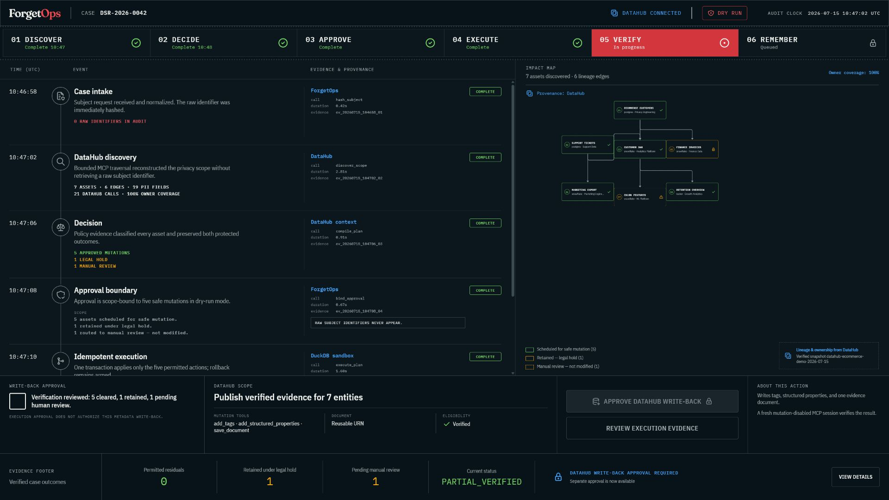
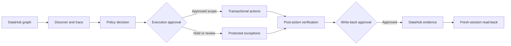

# ForgetOps

**DataHub context becomes operational proof.**

ForgetOps is a lineage-aware privacy-operations agent for right-to-erasure cases. It reconstructs a subject's downstream data footprint from DataHub, applies organization-defined policy, asks a human to approve an exact mutation scope, executes only permitted work, verifies every outcome, and writes reusable evidence back to DataHub.

The submission candidate includes a polished reviewer workbench, a deterministic offline path, a verified live DataHub MCP path, transactional execution, two separate approval boundaries, fresh-session write-back verification, and a 2:15 captioned demo video.

**Try the reviewer workbench:** [zheyuanhu2-sketch.github.io/forgetops](https://zheyuanhu2-sketch.github.io/forgetops/)

**Source:** [github.com/zheyuanhu2-sketch/forgetops](https://github.com/zheyuanhu2-sketch/forgetops)

**Frozen release:** [v1.0.0-hackathon-submission](https://github.com/zheyuanhu2-sketch/forgetops/releases/tag/v1.0.0-hackathon-submission)

**Demo video:** [ForgetOps — DataHub context becomes operational proof](https://youtu.be/XLa1o_3wABY)

**Devpost submission:** [devpost.com/software/forgetops](https://devpost.com/software/forgetops)



## 60-second judge route

Open the [hosted workbench](https://zheyuanhu2-sketch.github.io/forgetops/), follow the stage
rail from **Discover** to **Remember**, and inspect the protected legal-hold outcome before
approving the exact five-action scope. No account, credentials, or local setup are required.

The compact [judging guide](JUDGING.md) maps every scoring criterion to working product behavior
and checked-in evidence. Headline claims are also protected by a deterministic evidence gate:

```bash
uv run python scripts/verify_judging_evidence.py
```

ForgetOps also contributes the generalized workflow upstream through
[DataHub Skills PR #37](https://github.com/datahub-project/datahub-skills/pull/37): a standalone
privacy-operations skill, evidence contract, approval-ready plan template, and five adversarial
safety evaluations.

## The problem

Deleting one customer row is easy. Proving that the same person's data was handled across source tables, warehouse copies, support systems, derived features, and downstream consumers is not. A reliable operation must follow lineage, respect legal holds, identify owners, limit mutation scope, verify postconditions, and preserve audit evidence.

ForgetOps makes DataHub the control plane for that work:

1. **Discover** PII-bearing assets and subject keys through DataHub search and schema metadata.
2. **Trace** asset and column lineage into a bounded impact map.
3. **Decide** from explicit retention, legal-hold, ownership, and handling metadata—not model guesswork.
4. **Approve** an exact dry-run plan while protected outcomes remain visibly out of scope.
5. **Execute** permitted actions in one idempotent transaction with rollback on failed contracts.
6. **Verify** permitted residuals, exceptions, and replay behavior before reporting an honest result.
7. **Remember** through a second approval that writes tags, structured properties, and an evidence document to DataHub.
8. **Read back** the result from a fresh mutation-disabled MCP session.



## Verified demo case

The checked-in synthetic case contains no real personal data. One verified DataHub run produced:

| Evidence                   | Result |
| -------------------------- | -----: |
| Bounded official MCP calls |     21 |
| Assets reconstructed       |      7 |
| Lineage edges              |      6 |
| PII fields                 |     19 |
| Assets with owner coverage |   100% |
| Permitted actions          |      5 |
| Legal holds                |      1 |
| Human-review outcomes      |      1 |

The correct case result is `PARTIAL_VERIFIED`: every permitted residual is zero, while the legal-hold and manual-review records remain untouched and visible. An idempotent replay returns the same evidence without executing the work twice.

## Why DataHub is essential

ForgetOps does not use DataHub as a decorative lookup. The context graph determines the operation:

- schema fields identify subject keys and PII;
- lineage expands the downstream blast radius;
- ownership routes unresolved outcomes;
- structured properties encode handling, retention, and legal-hold signals;
- official MCP mutation tools return approved status and evidence to the graph;
- a fresh read-only session verifies the write-back instead of trusting the mutating session.

The live and offline adapters normalize into one strict domain model, so judges can reproduce the complete workflow without a heavy runtime while the submission still demonstrates a real DataHub integration.

## Reviewer workbench

Prerequisites: Node.js 22 and npm.

```bash
cd web
npm ci
npm run dev
```

Open `http://localhost:5173`. The primary journey is fully interactive: inspect discovery evidence, acknowledge protected outcomes, approve five dry-run actions, execute and verify, replay idempotently, grant a separate write-back approval, and inspect the evidence contract.

The deterministic UI is backed by the checked-in verified run, not invented dashboard metrics. It remains usable at 1280×720, supports keyboard navigation and reduced motion, and passes automated WCAG AA checks.

## Deterministic CLI quickstart

Prerequisites: [`uv`](https://docs.astral.sh/uv/) and Python 3.11.

```bash
uv sync --extra dev --python 3.11
uv run forgetops plan \
  --graph examples/input/ecommerce-privacy-graph.json \
  --subject-id customer-0042 \
  --request-id DSR-2026-0042 \
  --output-dir artifacts/runtime/DSR-2026-0042
uv run pytest
```

The raw subject identifier is hashed immediately and never written to plans, logs, DataHub, or evidence artifacts.

## Transactional sandbox execution

Both initialization and execution are non-mutating until explicitly approved:

```bash
uv run forgetops sandbox-init \
  --scenario examples/input/ecommerce-sandbox.json \
  --database artifacts/runtime/forgetops.duckdb
uv run forgetops sandbox-init \
  --scenario examples/input/ecommerce-sandbox.json \
  --database artifacts/runtime/forgetops.duckdb \
  --approve
uv run forgetops sandbox-execute \
  --plan examples/output/erasure-plan.json \
  --scenario examples/input/ecommerce-sandbox.json \
  --database artifacts/runtime/forgetops.duckdb \
  --subject-id customer-0042 \
  --idempotency-key demo-execute-v1
# Add --approve only after reviewing the dry-run evidence.
```

Approved actions run in one DuckDB transaction. Any failed field contract or post-action check rolls back the complete case.

## Live DataHub integration

The pinned DataHub Core 1.6 runtime uses a dedicated WSL distribution named `forgetops-runtime`. Its virtual disk, Docker state, Python environment, CLI state, and caches live under ignored repository-local directories on the current drive. The wrapper refuses to use Docker Desktop or a WSL distribution registered outside this repository.

```powershell
uv sync --extra dev --extra datahub --python 3.11
.\scripts\setup-runtime.ps1
.\scripts\setup-runtime.ps1 -Approve
.\scripts\datahub.ps1 start -AllowPull
.\scripts\datahub.ps1 check
uv run python scripts/seed_datahub.py             # dry-run manifest
uv run python scripts/seed_datahub.py --approve   # synthetic metadata only
uv run python scripts/smoke_datahub_graph.py       # official MCP -> plan
uv run python scripts/smoke_datahub_writeback.py   # dry-run write-back manifest
uv run python scripts/smoke_datahub_writeback.py --approve
```

All published quickstart ports bind to `127.0.0.1`. The stack intentionally follows DataHub's local quickstart security posture and must not be exposed to an untrusted network. It needs approximately 8 GB of available memory and 13 GB of repository-drive space. Stop only this project with `.\scripts\datahub.ps1 stop`.

## Safety invariants

- Dry-run is the default; every mutation requires explicit approval.
- Execution and metadata write-back use separate approval boundaries.
- Idempotency keys bind to the exact approved plan and scenario.
- Sandbox mutations run in one transaction and roll back on any failed contract.
- Legal-hold and review signals create protected outcomes instead of being overridden.
- Policy comes from organization-defined metadata; an LLM may explain but cannot invent it.
- Every action cites the DataHub evidence that caused it.
- No real personal data, credentials, or data-subject identifiers are included.

ForgetOps is an engineering demonstration, not legal advice. Organizations remain responsible for policy configuration and legal validation in their jurisdictions.

## Validation

```bash
uv run ruff format --check .
uv run ruff check .
uv run mypy src
uv run python scripts/verify_judging_evidence.py
uv run pytest --cov=forgetops --cov-report=term-missing

cd web
npm ci
npm run format:check
npm run lint
npm run typecheck
npm run test:coverage
npm run demo:smoke
npm run build
```

The video composition is also reproducible from `demo-video/` with HyperFrames. Its final media probe is 1920×1080, H.264 at 24 fps, AAC stereo, and 135.04 seconds—strictly under the three-minute submission limit.

## Repository map

```text
src/forgetops/       deterministic planning, policy, reporting, and execution core
tests/               unit and integration coverage for safety and evidence behavior
web/                 interactive reviewer workbench and browser-focused tests
examples/            synthetic inputs and checked-in judge-readable evidence
infra/datahub/       pinned, loopback-only, project-prefixed DataHub quickstart
scripts/             dry-run seed, live MCP smokes, and isolated runtime controls
demo-video/          design direction, script, captions, composition, and source captures
submission/          Devpost copy and release checklist
docs/                architecture, official rules, migration proof, and delivery state
JUDGING.md            60-second judge route and criterion-to-evidence map
```

## Hackathon fit

- **Selected challenge:** Agents That Do Real Work
- **DataHub technologies:** DataHub Core, official MCP Server tools, context documents, structured properties, tags, schema metadata, ownership, and lineage
- **Differentiator:** an auditable privacy-operation control loop rather than a metadata chatbot

## License

Apache License 2.0. See [LICENSE](LICENSE) and [THIRD_PARTY_NOTICES.md](THIRD_PARTY_NOTICES.md).
